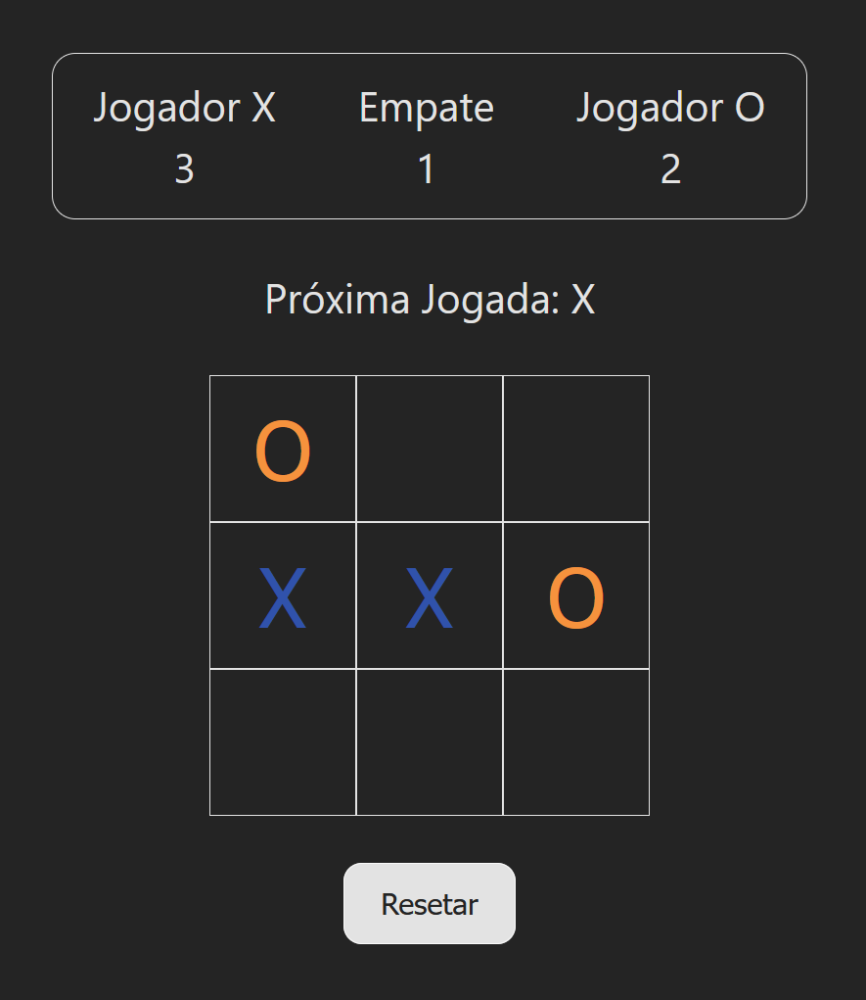

<h1 align="center">Jogo da Velha (Tic-Tac-Toe)</h1>

  
  
  

### Tópicos

- [Projeto](#pensil2-projeto)

- [Funcionalidades](#pencil-funcionalidades)

- [Tecnologias](#computer-tecnologias)

 

## :pencil2: Projeto

Jogo da velha com funcionalidades básicas e placar, desenvolvido em React.

 

  

 

## :pencil: Funcionalidades

- Zerar o placar.

## :computer: Tecnologias

Projeto foi desenvolvido com as seguintes tecnologias:

- React;

- JavaScript

- Vite;

- CSS.
